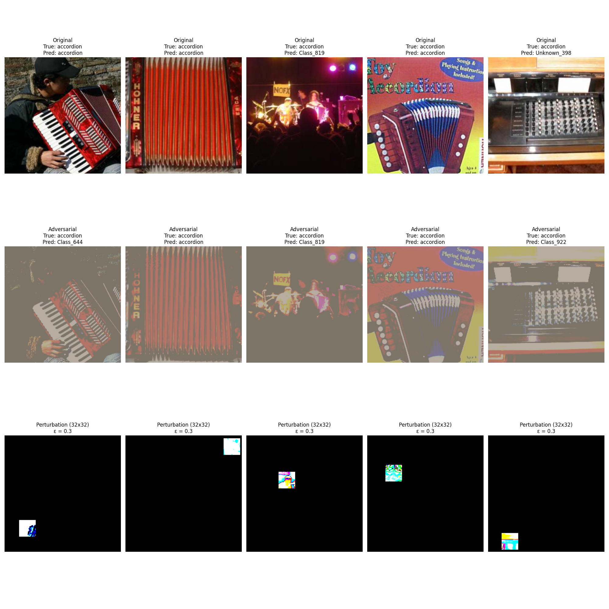
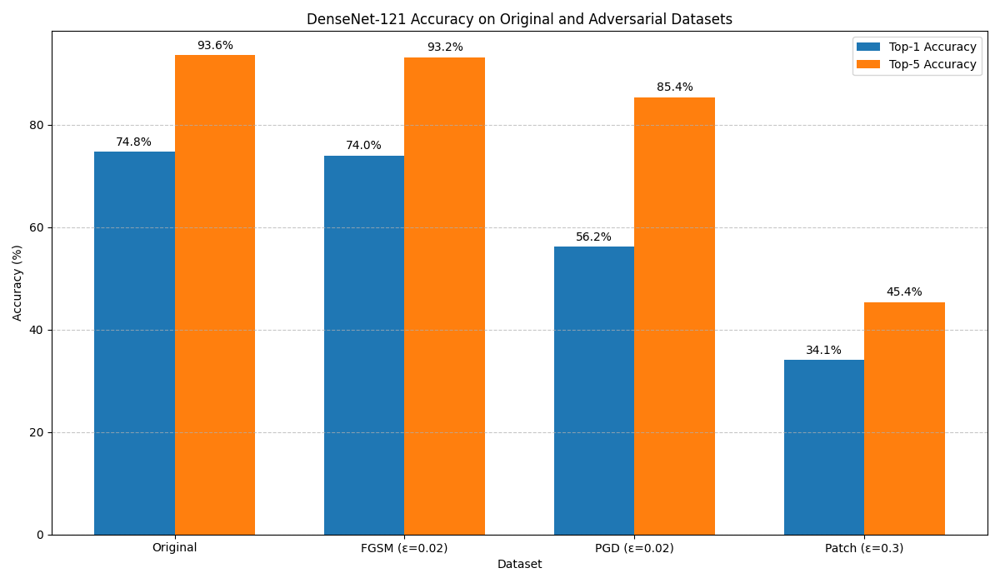

# Deep Learning Project: Jailbreaking Deep Models

This project demonstrates adversarial attacks on production-grade image classifiers, focusing on crafting minimal perturbations that significantly degrade model performance while remaining imperceptible.

## Quick Start

```bash
# Setup environment
chmod +x setup.sh && ./setup.sh

# Activate environment
source act.sh

# Run individual tasks
python experiments/task1_baseline.py  # Baseline evaluation
python experiments/task2_fgsm.py      # FGSM attack
python experiments/task3_advanced_attack.py  # PGD attack
python experiments/task4_pgd_patch.py  # Patch attack
python experiments/task5_transfer.py  # Transferability analysis

# Or use make
make all  # Run all tasks
make clean  # Clean generated files
```

## Project Structure

```
deep‑models‑jailbreak/
├── src/                       # Core implementation code
│   ├── dataset.py             # Dataset loading utilities
│   ├── metrics.py             # Evaluation metrics
│   ├── viz.py                 # Visualization utilities
│   └── attacks/               # Attack implementations
│       ├── fgsm.py            # Single-step attack
│       ├── pgd_full.py        # Iterative full-image attack
│       ├── pgd_patch.py       # Iterative 32×32 patch attack
│       └── utils.py           # Attack utilities
├── experiments/               # Experiment scripts for each task
├── configs/                   # Configuration files
├── data/                      # Data directory (git-ignored)
└── figures/                   # Generated visualizations
```

## Results Summary

### Task 1: Baseline Evaluation

ResNet-34 pretrained on ImageNet-1K evaluated on a 100-class subset:
- **Top-1 Accuracy**: 76.00%
- **Top-5 Accuracy**: 94.20%

### Task 2: FGSM Attack (ε=0.02)

Fast Gradient Sign Method generates adversarial examples with imperceptible perturbations:


**Results**:
- **Top-1 Accuracy Drop**: 76.00% → 6.80% (-69.20%)
- **Top-5 Accuracy Drop**: 94.20% → 20.60% (-73.60%)
- **Max L∞ Distance**: 0.02

### Task 3: PGD Attack (ε=0.02)

Projected Gradient Descent with multiple iterations achieves complete model failure:


**Results**:
- **Top-1 Accuracy**: 0.00% (100% attack success)
- **Top-5 Accuracy**: 0.00%
- **Attack Parameters**: 
  - ε = 0.02 (perturbation budget)
  - α = 0.004 (step size)
  - iterations = 20
  - random_start = True

### Task 4: Patch Attack (32×32 patch, ε=0.3)

Localized attack concentrates perturbations in a small 32×32 patch:



**Results**:
- **Top-1 Accuracy Drop**: 76.00% → 40.20% (-35.80%)
- **Top-5 Accuracy Drop**: 94.20% → 65.80% (-28.40%)
- **Attack Success Rate**: 48.40%
- **Perturbation Budget**: ε = 0.3 (higher than full-image attacks)
- **Affected Area**: Only 4% of image pixels (32×32 patch in 224×224 image)

### Task 5: Transferability Analysis

Testing adversarial examples on DenseNet-121:



**Results**:
| Attack Method | Transfer Rate | Effectiveness |
|---------------|--------------|--------------|
| FGSM (ε=0.02) | 1.1% | Limited |
| PGD (ε=0.02) | 24.9% | Limited |
| Patch (ε=0.3) | 54.4% | Moderate |

**Key Insight**: Patch attacks show surprisingly high transferability despite affecting fewer pixels.

## Conclusion

This project demonstrates:

1. State-of-the-art image classifiers remain highly vulnerable to imperceptible adversarial perturbations
2. PGD can achieve 100% attack success rate while respecting strict perturbation constraints
3. Even constraining perturbations to small image patches yields significant accuracy drops
4. Patch-based attacks transfer better across model architectures than full-image attacks
5. Implementation details (normalization handling, initialization, gradient computation) significantly impact attack effectiveness

These findings raise important questions about the robustness and security of deep learning systems in real-world applications.